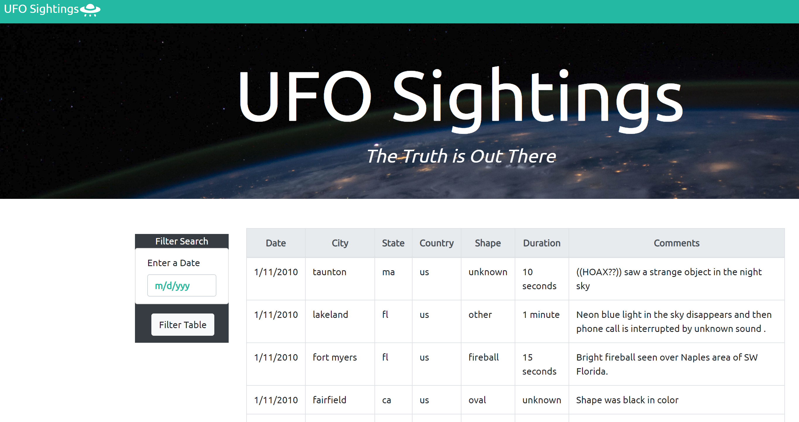
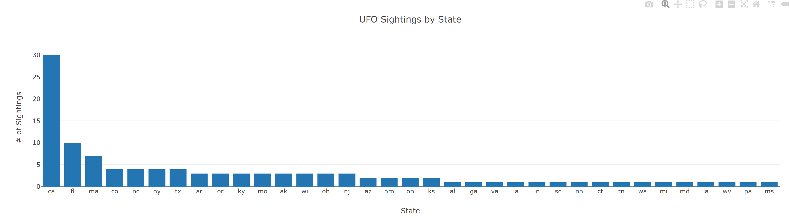

# UFOs_JavaScript
Program that creates a table dynamically based upon a provided dataset and allows users to filter the table for a specific date. Leveraging different languages: JavaScript, D3.js, HTML, & CSS. 

**See below for links to work:**
* [JavaScript](static/js/app.js)
* [HTML](index.html)
* [Plotly Code](static/js/plot.js)
* [Dataset](static/js/data.js)
 
 

**Frontend Visual & Graph:**
 

 
 

